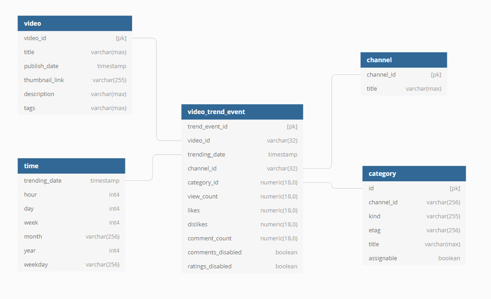
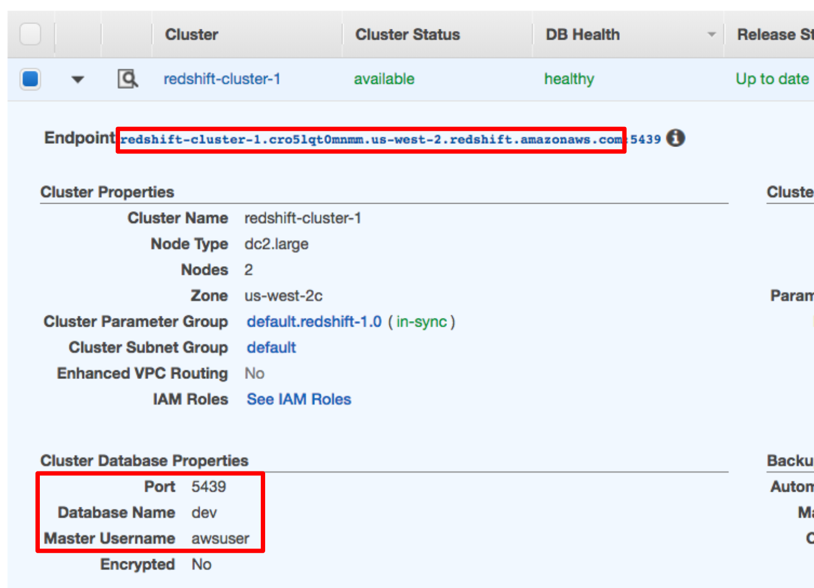
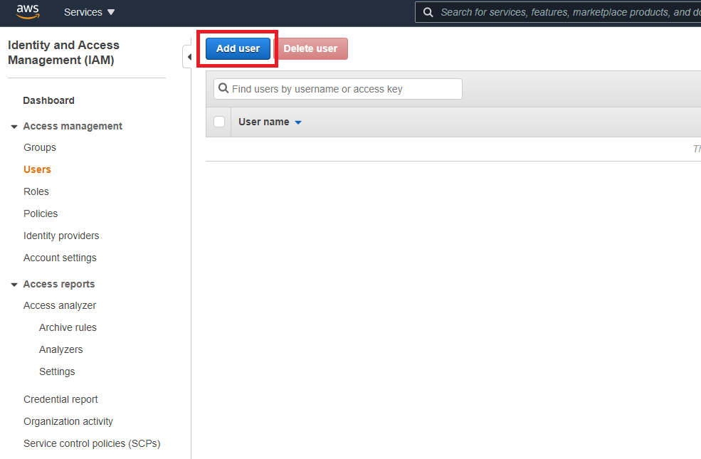
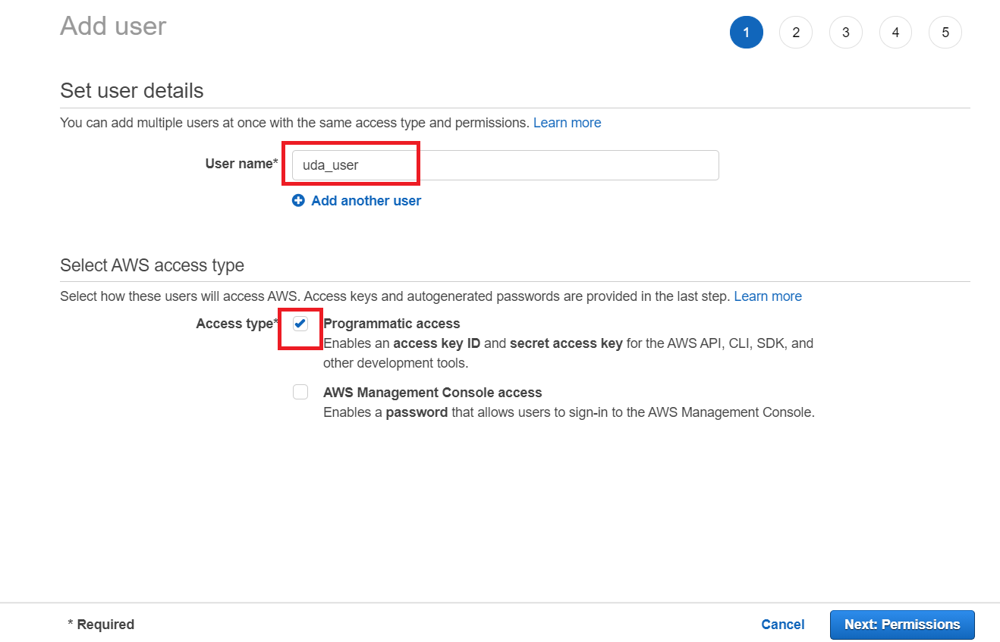
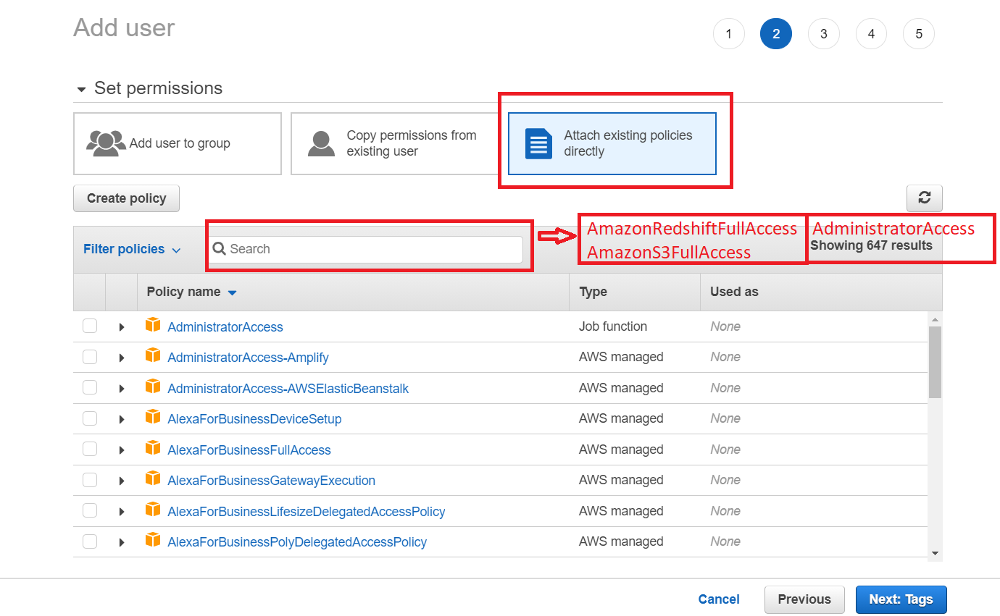
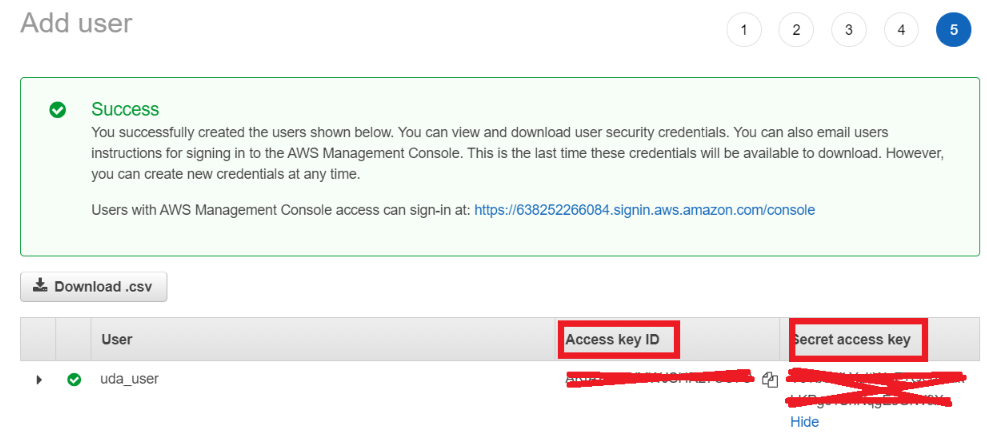

# Capstone Project: Youtube Trend Data Flow
This repository was created as part of my training on Udacity. For detailed information, you can check the https://www.udacity.com/course/data-engineer-nanodegree--nd027 link.

## Introduction
An unreal company was assumed exist for this final project. This company name is Social Fetcher. Social Fetcher is  a company that follows social media trends and conducts analytical studies on these trends.

Social Fetcher Data Team has decided that make analytical studies on Youtube Trends. The Social Fetcher Data Team determined that a data flow should be created for these studies. They aim to collect data in their own DWH layer. As a first step, Team decided to get the data from Youtube company to a common platform. Then, Team agreed with Youtube to stream trend data to Social Fetcher S3 environment. After data is begin collecting on a common platform, Team want the development of ETL jobs that will transfer this data to the DWH layer. Also, Team want automation and monitoring to their data warehouse ETL pipelines and come to the conclusion that the best tool to achieve this is Apache Airflow.

They have decided to bring me into the project and expect me to create high grade data pipelines that are dynamic and built from reusable tasks, can be monitored, and allow easy backfills. They have also noted that the data quality plays a big part when analyses are executed on top the data warehouse and want to run tests against their datasets after the ETL steps have been executed to catch any discrepancies in the datasets.

The source data resides in S3 and needs to be processed in Social Fetcher's data warehouse in Amazon Redshift. The source datasets consist of CSV daily trend logs that tell about video trend on Youtube.

## Project Datasets
This project idea was inspired by data of https://www.kaggle.com/rsrishav/youtube-trending-video-dataset

"***This dataset includes several months (and counting) of data on daily trending YouTube videos. Data is included for the IN, US, GB, DE, CA, FR, RU, BR, MX, KR, and JP regions (India, USA, Great Britain, Germany, Canada, France, Russia, Brazil, Mexico, South Korea, and, Japan respectively), with up to 200 listed trending videos per day.
Each region’s data is in a separate file. Data includes the video title, channel title, publish time, tags, views, likes and dislikes, description, and comment count.
The data also includes a category_id field, which varies between regions. To retrieve the categories for a specific video, find it in the associated JSON. One such file is included for each of the 11 regions in the dataset.***" [https://www.kaggle.com/rsrishav/youtube-trending-video-dataset, Content]

The details of the data have been given above. Social Fetcher Data Team decided each country files data come together in related continent folder when data collecting. The reason of this distribution, data collect wanted on closest network location.

File distributions of the countries are as follows:
- America continent: s3://onur-uda-america/{country} , country => Brazil, Canada, Mexico, USA
- Asia continent: s3://onur-uda-asia/{country} , country => India, Japan, Russia, SouthKorea
- Europe continent: s3://onur-uda-america/{country} , country => France, Germany, GreatBritain

Each country folder include category and trending data files. For example: 
- s3://onur-uda-europe/France/FR_category_id.json
- s3://onur-uda-europe/France/FR_youtube_trending_data.csv

## Project General Folder Structure
To get started with the project, you can find files at repository's main branch. You can clone or download the project template files from the repository, if you'd like to develop your project locally.

The project general folder structure includes:

  * `airflow/` contains developed Airflow component files
    * `dags/` contains ETL dag file and category files S3 metadata file
    * `plugins/` contains developed special plugins folder for this project
        * `helpers/` contains table queries script for usage while copy data between redshift tables
        * `operator` contains all(flat operator, stage operators, load operators and quality check operator) operator files for necessary ETL steps
    * `create_tables.sql` contains stage, fact and dimension tables DDL scripts
    * `plugins.zip` compressed version of plugins folder for MWAA Airflow Environment 
  * `create_environment/` contains creation scripts of necessary AWS environments for this project. If you have already exist environments on AWS you don't have to use scripts under tihs folder
    * `airflow_policy.json` contains policy json metadata for AWS IAM special policy. This policy using for Airflow environment creation on AWS MWAA.  
    * `config.cfg` contains all environments information and credantials keys 
    * `config_parser.py` parses config.cfg file for usage in python scripts
    * `create_envs.py` creates redshift and airflow environment on AWS
    * `create_pre_req.py` creates pre requirement(vpc, role, policy vb.) objects for Airflow environment.
    * `load_airflow_files.py` loads all Airflow folders to S3 Airflow's bucket.   
  * `bonus/` contains queries for getting data from Redshift and Spark jobs scripts. This folder is not yet complete. You can find basic query samples for now
  * `README.md` provides introduction about project

## Project Technology Stack
The following technologies were used in this project:
- ***AWS S3:*** Data comes from Youtube as small size log files. For this reason, best choice S3 buckets for don't depend a data structure. 
- ***AWS Redshift:*** Redshift is used for storing data as a table in the data warehouse. It is used for both staging and relational structures.
- ***AWS MWAA Airflow Environment:*** The Airflow is used for automation and monitoring to data warehouse ETL pipelines.
  
## DWH Schema for Youtube Trending Data
 > 

### Fact Table
1. **video_trend_event** - records of video trending logs 
   * ***trend_event_id***, unique number for each event row
   * ***video_id***, identifier number of video
   * ***channel_id***, identifier number of channel
   * ***category_id***, identifier number of category
   * ***view_count***, video views count per trend event
   * ***likes video***, views count per trend event
   * ***dislikes***, video dislikes count per trend event 
   * ***comment_count***, video comments count per trend event 
   * ***comments_disabled***, 'is video comments functionality disable' information 
   * ***ratings_disabled***, 'is video rating functionality disable' information

### Dimension Tables
1. video - videos on Youtube 
   * ***video_id***, identifier number of video
   * ***title***, title of video
   * ***publish_date***, first publish date of video 
   * ***thumbnail_link***, video's thumbnail link
   * ***description***, description of video
   * ***tags***, tags of vide
   
2. channel - channels of videos
   * ***channel_id***, identifier number of channel
   * ***title***, title of channel
   
3. category - categories of videos
   * ***id***, identifier number of category
   * ***channel_id***, identifier number of category channel. this channel specified for category. 
   * ***kind***, produced by Youtube kind tag for each category
   * ***etag***, produced by Youtube etag tag for each category
   * ***title***, title of category
   * ***assignable***, 'is category assignable' information
   
4. time - timestamps of records in video_trend_event 
   * ***trending_date***, unique trend event date 
   * ***hour***, hour of trend event date 
   * ***day***, day of trend event date
   * ***week***, week number of trend event date
   * ***month***, month of trend event date
   * ***year***, year of trend event date
   * ***weekday***, weekday of trend event date

## Airflow 
ETL works of this project will be executed and monitored on Airflow. Developed Airflow structures are described below.

### Operators
In project scope, the following operators have been customized

### Flat Operator
The hierarchy of Youtube category JSON files aren't suitable for adding to the table. Therefore, this operator convert these files to flat hierarchy JSON file. Then, it uploads flat verison to under related country folder. 

### Stage CSV Operator
The stage operator is expected to be able to load any CSV formatted files from S3 to Amazon Redshift. The operator creates and runs a SQL COPY statement based on the parameters provided. The operator's parameters should specify where in S3 the file is loaded and what is the target table.

The parameters should be used to distinguish between CSV file. Another important requirement of the stage csv operator is containing a manifest field. Manifest field give change for load multi file in one request. For example, by collecting the names of the files of all countries in the continent file in a manifest file, the data of all countries can be uploaded in a single request.

### Stage JSON Operator
The stage operator is expected to be able to load any JSON formatted files from S3 to Amazon Redshift. The operator creates and runs a SQL COPY statement based on the parameters provided. The operator's parameters should specify where in S3 the file is loaded and what is the target table.

The parameters should be used to distinguish between JSON file. Another important requirement of the stage json operator is containing a templated field that allows it to load timestamped files from S3 based on the execution time and run backfills, also, manifest field give change for load multi file in one request. For example, by collecting the names of the files of all countries in the continent file in a manifest file, the data of all countries can be uploaded in a single request. 

### Fact and Dimension Operators
With dimension and fact operators, you can utilize the provided SQL helper class to run data transformations. Most of the logic is within the SQL transformations and the operator is expected to take as input a SQL statement and target database on which to run the query against. You can also define a target table that will contain the results of the transformation.

Dimension loads are often done with the truncate-insert pattern where the target table is emptied before the load. Thus, you could also have a parameter that allows switching between insert modes when loading dimensions. Fact tables are usually so massive that they should only allow append type functionality.

### Data Quality Operator
The final operator to create is the data quality operator, which is used to run checks on the data itself. The operator's main functionality is to receive one or more SQL based test cases along with the expected results and execute the tests. For each the test, the test result and expected result needs to be checked and if there is no match, the operator should raise an exception and the task should retry and fail eventually.

For example one test could be a SQL statement that checks if certain column contains NULL values by counting all the rows that have NULL in the column. We do not want to have any NULLs so expected result would be 0 and the test would compare the SQL statement's outcome to the expected result.

## ETL Pipeline
In this project, used Airflow for orchestration etl processes. Airflow DAG architecture is below. 

  > 
  
 
# Preparation for Airflow
1. To go to the Airflow UI

2. Click on the Admin tab and select Connections.
  > 

3. Under Connections, select Create.
  > 

4. On the create connection page, enter the following values:
   * **Conn Id**: Enter `aws_credentials`.
   * **Conn Type**: Enter `Amazon Web Services`.
   * **Login**: Enter your Access key ID from the IAM User credentials you downloaded earlier.
   * **Password**: Enter your Secret access key from the IAM User credentials you downloaded earlier.
   Once you've entered these values, select Save and Add Another.
  > 

5. On the next create connection page, enter the following values:
   * **Conn Id**: Enter `redshift`.
   * **Conn Type**: Enter `Postgres`.
   * **Host**: Enter the endpoint of your Redshift cluster, excluding the port at the end. You can find this by selecting your cluster in the Clusters page of the Amazon Redshift console. See where this is located in the screenshot below. IMPORTANT: Make sure to NOT include the port at the end of the Redshift endpoint string.
   * **Schema**: Enter `dev`. This is the Redshift database you want to connect to.
   * **Login**: Enter `awsuser`.
   * **Password**: Enter the password you created when launching your Redshift cluster.
   * **Port**: Enter `5439`.
    Once you've entered these values, select Save.
  > 
  > 
    Awesome! You're now all configured to run Airflow with Redshift.

## Project Running
You can running this project on your environment by following the steps below. If you have already Redshift and Airflow environments, you should jump step 3.

- ***Step 1: Create AWS User***
    - You should create a user on AWS for programatic access. This user must have AmazonRedshiftFullAccess, AmazonS3FullAccess, AdministratorAccess permissions. You can create user as like below:
        > 
        > 
        > 
        > 
    - After user creation, you must update [AWS_ACCESS] KEY and SECRET variable on config.cfg file with new user access credentials.
- ***Step 2: Create Environments***
    - You must install boto3 library for this step.
        > pip install boto3
    - Create necessary Policy, Role, VPC and S3 bucket for AWS MWAA Airflow environment. ***Note:*** **(If you have already exist these objects you can pass this process and fill requirement fields on configuration file for next process.)** 
        > python create_environment/create_pre_req.py
    - Aftre creation pre requirements, you must update config file. If you have already exist role, policy, sub group you can use your own objects.
        - [IAM_ROLE] REDSHIFT_ARN, created role ARN
        - [AWS_AIR] EXECUTION_ROLE_ARN, 
        - [AWS_AIR] VPC_ID, created VPC ID
        - [AWS_AIR] SUBNET_PUBLIC_IDS, created VPC's subnet public id's with comma delimiter
        - [AWS_AIR] SUBNET_PRIVATE_IDS, created VPC's subnet private id's with comma delimiter
        - [AWS_AIR] SECURITY_GROUP_ID, this parameter must set if you have already exist security group for Airflow.    
    - Create Redshift and Airflow environment on AWS. ***Note:*** **(This process's default create both of them. If you have one of the two environments, you can change relevant variable(s) to False under AWS_ENV_CREATE from the configuration file. Anyway, if you have both you can pass this process.)**
        > python create_environment/create_envs.py
- ***Step 3: Load Airflow Files***
    - If you'll create Airflow environment on AWS, you can run this process. ***Note:*** **(If you have already exist your own server, you should copy manually. Otherwise, you can change config file settings for your own AWS environment.)**
        > python create_environment/load_airflow_files.py    
- ***Step 4(Extra): Additional Concepts*** 
    - ***You can find related documents under `bonus/` folder. There are only a few sample queries yet. PySpark and advance queries will be added in the future. Be tuned.***
    - After you load data your DWH stage, you can create queries for dashboards or reports.
    - You can process data and work on analytic jobs with Spark. For this, you can perform this job on your own servers or using AWS EMR.     
 
## Answers to Some Approaches Questions
- **When the data was increased by 100x, do you store the data in the same way? If your project is heavy on reading over writing, how do you store the data in a way to meet this requirement? What if the requirement is heavy on writing instead?**
    - The current schema structure is very primitive. If the incoming data size increases, storage space is increased first. Secondly, pre-storage environment S3  can be replaced with a document-based database like Mongo DB. In a scenario where reading operations are intense, Redshift technology can be used again. In order to increase reading performance, the distrubution key  structure can be apply to tables by preserving the star schema structure. If the number of writes increases, the number of nodes can be increased to increase parallelism. In addition to these operations, server resources can be increased for avoid memory issues in each node.    

- **How do you run this pipeline on a daily basis by 7 am every day. What if the dag fails, how do you update the dashboard? Will the dashboard still work? Or will you populate the dashboard by using last day?**
    - In order to run at a certain time every day, "0 7 * * *" is given as an example of the schedule_interval parameter in DAG settings. Scheduling can be done with Crontab statements. If the DAGs get an error, it can be retried by editing the retries parameter in the DAG settings. If it fails in retries, it can be trigger manually to make it work.

- **How do you make your database could be accessed by 100+ people? Can you come up with a more cost-effective approach? Does your project need to support 100+ connection at the same time?**
    - A structure can be built microservice infrastructure to meet the demands of all users at the same time. Each microservice can fetch data from database cluster parallelly.
